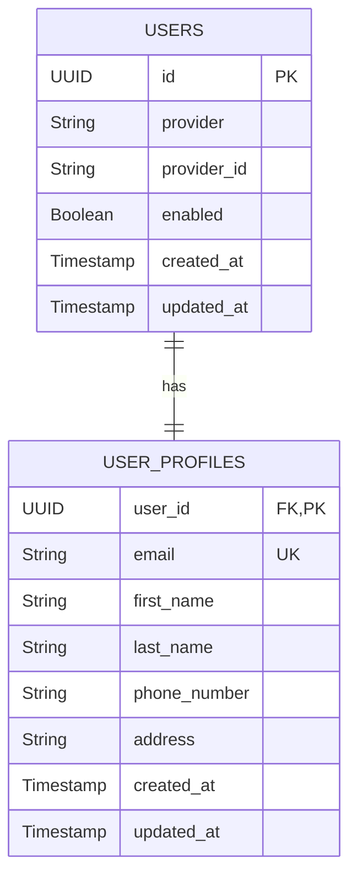

# Data Model: User Service

**Feature**: User Service (Registration, Auth, Profile)
**Schema Version**: 1.0

## Entity Relationship Diagram (Conceptual)



## Schema Definitions (PostgreSQL)

### 1. Table: `users`

Core identity table. Handles authentication credentials and account status.

| Column          | Type         | Constraints  | Description                           |
|:----------------|:-------------|:-------------|:--------------------------------------|
| `id`            | UUID         | PK, Not Null | Unique identifier                     |
| `provider`      | VARCHAR(50)  | Not Null     | Auth provider (LOCAL, GOOGLE, GITHUB) |
| `provider_id`   | VARCHAR(255) | Nullable     | ID from external provider             |
| `enabled`       | BOOLEAN      | Default TRUE | Account active status                 |
| `created_at`    | TIMESTAMP    | Not Null     | Audit timestamp                       |
| `updated_at`    | TIMESTAMP    | Not Null     | Audit timestamp                       |

**Indexes**:

### 2. Table: `user_profiles`

Personal information separate from credentials. 1:1 relationship with `users`.

| Column         | Type         | Constraints        | Description   |
|:---------------|:-------------|:-------------------|:--------------|
| `user_id`      | UUID         | PK, FK(`users.id`) | Links to User |
| `email`        | VARCHAR(255) | UK, Not Null       | User login handle |
| `first_name`   | VARCHAR(100) | Nullable           |               |
| `last_name`    | VARCHAR(100) | Nullable           |               |
| `phone_number` | VARCHAR(20)  | Nullable           |               |
| `address`      | TEXT         | Nullable           |               |
| `created_at`   | TIMESTAMP    | Not Null           |               |
| `updated_at`   | TIMESTAMP    | Not Null           |               |

## Java Entities (JPA)

### `User.java`

```java

@Entity
@Table(name = "users")
@Data // Lombok
public class User extends AuditableEntity {
    @Enumerated(EnumType.STRING)
    private AuthProvider provider; // LOCAL, GOOGLE, GITHUB

    private String providerId;

    private boolean enabled = true;

    // BaseEntity handles created/updated_at with @PrePersist/@PreUpdate
}
```

### `UserProfile.java`

```java

@Entity
@Table(name = "user_profiles")
@Data
public class UserProfile extends AuditableEntity {
    @OneToOne(fetch = FetchType.LAZY)
    @MapsId
    @JoinColumn(name = "user_id")
    private User user;

    @Column(unique = true, nullable = false)
    private String email;
    
    @Column
    private String firstName;

    @Column
    private String lastName;

    @Column
    private String phoneNumber;

    @Column
    private String address;
}
```

## Validation Rules

1. **Email**: Must be valid email format (Regex).
2. **Password**: Min 8 chars, mixed case/numbers (Enforced by Service layer before hashing).
3. **Phone**: E.164 format preferred.
